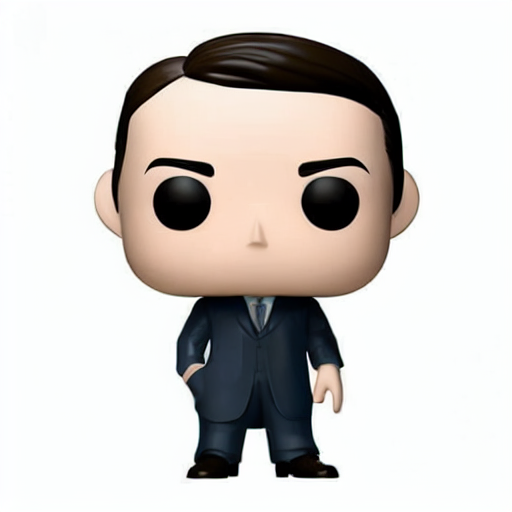
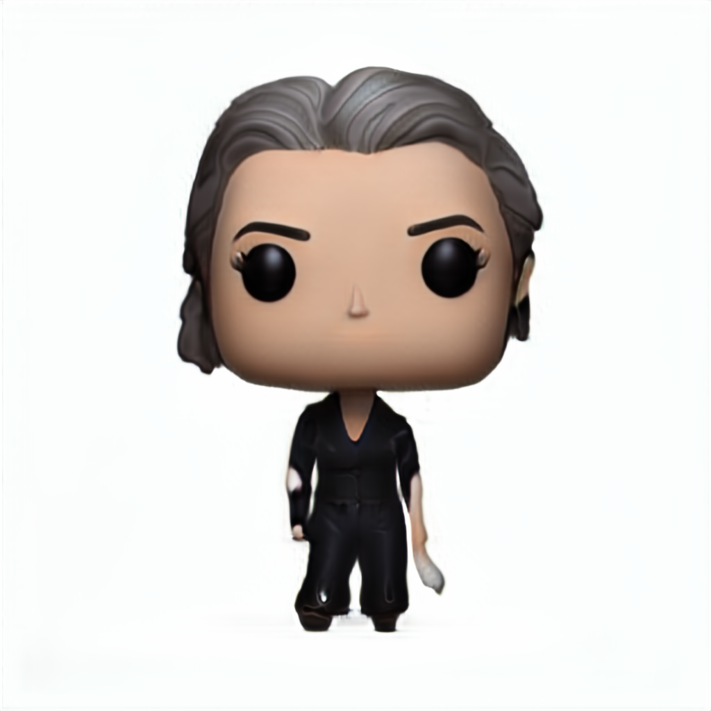
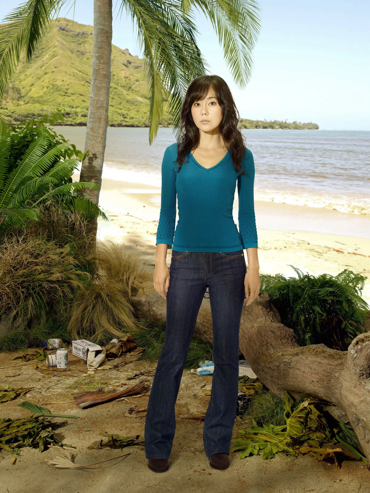
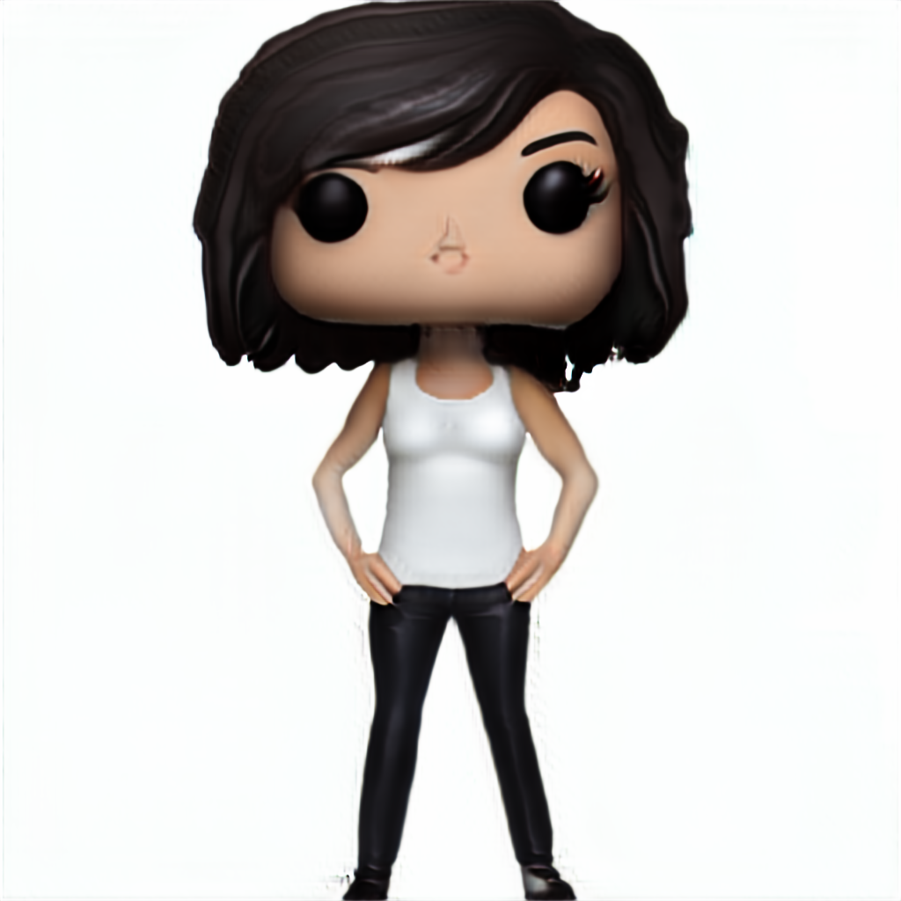
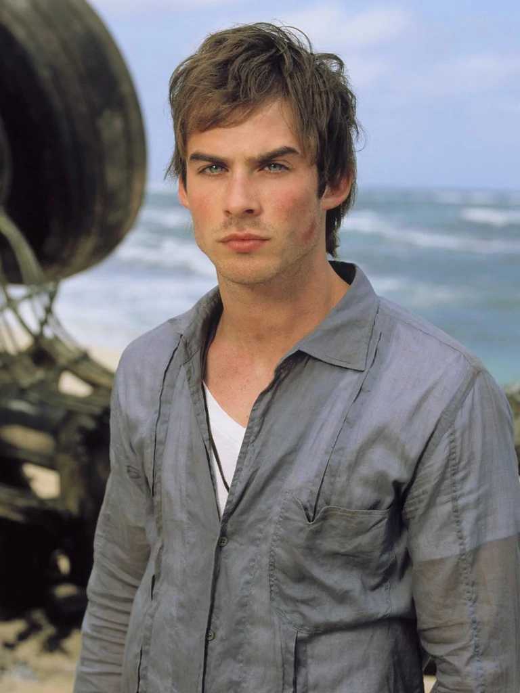
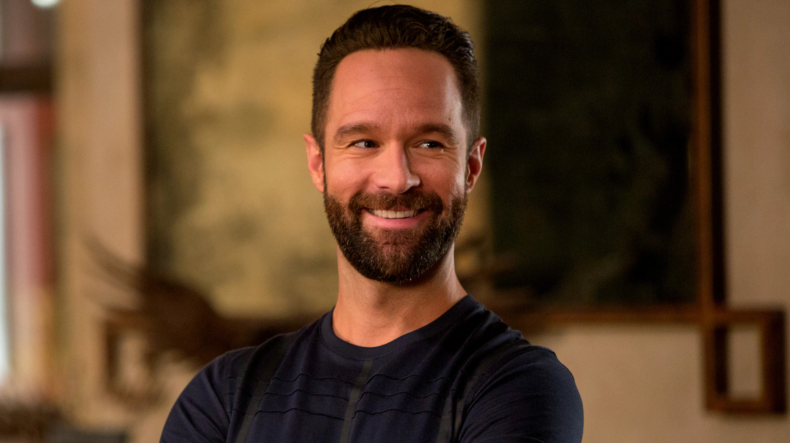
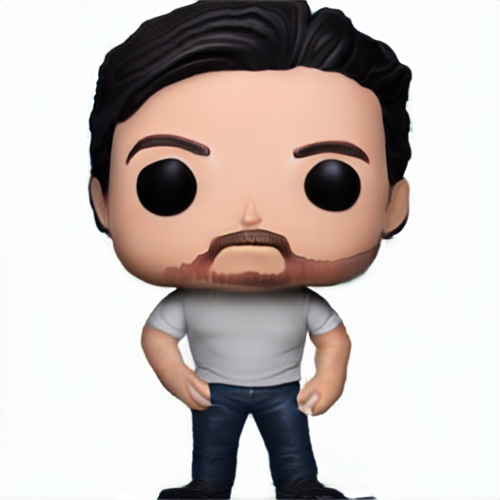
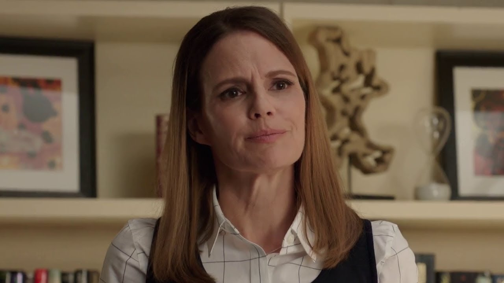

# PopYou!

PopYou! is a project to create custom Funko Pop figures from text and images. With PopYou!, you can bring your favorite characters and ideas to life in the iconic Funko Pop style.
Using Gans and not diffusion, such that the runtime and memory requirements are much lower.

## Method

first I generated 30000 images of funko using [deci diffusion](https://deci.ai/blog/decidiffusion-1-0-3x-faster-than-stable-diffusion-same-quality/).
Then I used the dataset to train a GAN model using FastGan and the results are below.

after that I froze the gan and created an inversion model using frozen clip as backbone,
this gives the inversion model the ability to generate images from text and from images in other domains such as real images of people and faces.

the examples below are generated using the inversion model such that the
text given is "funko pop figure of {name} in a white background".

| Celebrty Name    | PopYou! Model | [deci diffusion](https://deci.ai/blog/decidiffusion-1-0-3x-faster-than-stable-diffusion-same-quality/) |
|------------------|---------------|--------------------------------------------------------------------------------------------------------|
| Barack Obama     |  |                                                    |
| Alan Turing      |  |                                                     |
| Elsa from frozen |  |                                                            |

these are examples using the clip image encoding of a face of the person.

| Celebrty Name        | Image                                                        | PopYou! Model                                                 |
|----------------------|--------------------------------------------------------------|---------------------------------------------------------------|
| Sun from Lost        |            |            |
| Bon from Lost        |            |            |
| Ras from SiliconValley |   |   |
| Lori from SiliconValley |  |  |

## Results

|                 | PopYou! | deci diffusion |
|-----------------|---------|----------------|
| clip similarity | 0.31    | 0.33           |
| Fid             | 562     | 258            |

Note:
The fid is calculate between a folder generated from the model and the real images of funko pop.
The clip similarity is calculated between the text and the image generated from the model, it uses the text prefix above and a list 300 famous people.